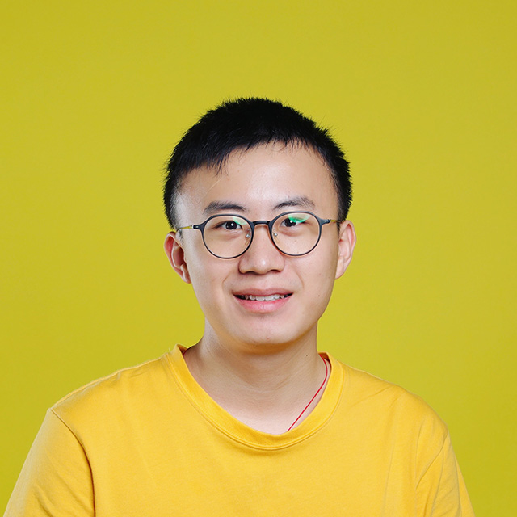

# Home

## Biography

</table>
<table class="tg">
<thead>
  <tr>
    <th class="tg-0lax"></th>
    <th class="tg-0lax">
    Ziqiang Li（李子强）  
    Email: lizq2019__AT__mail.sustech.edu.cn 
    Department of Computer Science and Engineering 
    Southern University of Science and Technology (SUSTech) 
    Shenzhen, China</th>
  </tr>
</thead>
</table>

I am currently a **master** student in **SUSTech**, supervised by Prof. [Shin Hwei Tan](https://www.shinhwei.com/). My research interests mainly focus on automated debugging and software repair.

## Education

* Southern University of Science and Technology
  * \[2015-2019\] *Bachelor* in Computer Science and Engineering (CSE)

## Publications

* \[ICSE 2020\] Collaborative bug finding for Android apps
  * Shin Hwei Tan, **Ziqiang Li**
  * [\[Pdf\]](./collab-bug-finding.pdf)

* \[ICSE 2020 Poster\] Bugine: a bug report recommendation system for Android apps
  * **Ziqiang Li**, Shin Hwei Tan
  * [\[Pdf\]](./ziqiang-icse2020-poster-preprint.pdf), [\[Poster\]](./ziqiang-icse2020-poster.pdf), [\[Video\]](https://youtu.be/v9qcGVhUIyI)

## Honors and awards

- Graduate scholarship, SUSTech, 2019 - 2022
- National undergraduate software testing competition finals, **Second Class**, Dec. 2019
- Testing Competition on International Symposium on Software Testing and Analysis ([ISSTA](https://conf.researchr.org/track/issta-2019/isstatestcomp-2019-papers)), **Fifth place**, Jul. 2019
- Outstanding UG teaching assistant, CSE department, SUSTech, Jul. 2019
- Annual outstanding students scholarship, **Third Class**, SUSTech, Oct. 2017
- Annual outstanding students scholarship, **Second Class**, SUSTech, Oct. 2016

## Experience

* **NVIDIA** Test Engineering Intern (Jul. 2018 - Jan. 2019)
* **The University of British Columbia**, Summer Program, Electrical and Electronics Engineering, (Jul. 2017, Aug. 2017)

## Service 

* Student assistant
  * **CS209A** Computer System Design and Application (A) (Spring 2018)
  * **CS205** C/C++ Programming Language (Spring 2019)
  * **CS304** Software Engineering (Spring 2019 [**Award**], Spring 2020)
  * **CS409** Software Testing (Fall 2019, Fall 2020)